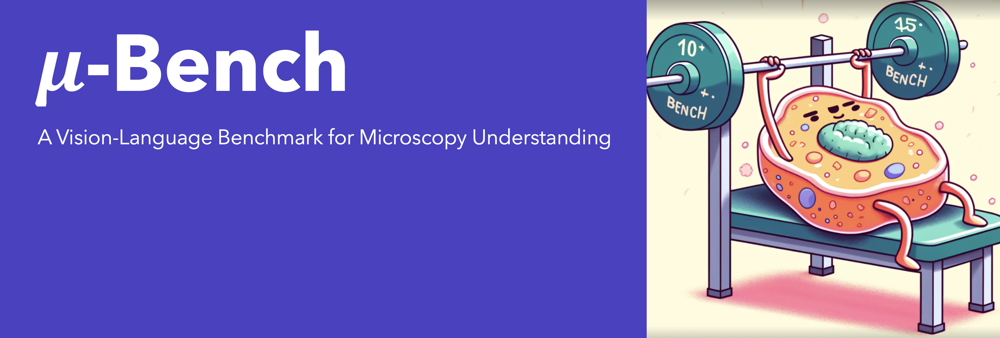

 
 
 Welcome to the official repository  for **μ-Bench:** A Vision-Language Benchmark for
Microscopy Understanding

<p align="center">
  <strong>Arxiv:</strong> <a href="https://arxiv.org/abs/2310.16146" target="_blank">Arxiv</a> 
  &nbsp;&nbsp;&nbsp;&nbsp;|&nbsp;&nbsp;&nbsp;&nbsp;
  <strong>Benchmark:</strong> <a href="https://huggingface.co/datasets/jnirschl/uBench" target="_blank"> HuggingFace</a> 
  &nbsp;&nbsp;&nbsp;&nbsp;|&nbsp;&nbsp;&nbsp;&nbsp;
  <strong>Website:</strong> <a href="https://ale9806.github.io/uBench-website/" target="_blank"> Doks</a>
 
  
</p>

[](https://huggingface.co/datasets/jnirschl/uBench)
[]( https://colab.research.google.com/drive/1G5DZQ2h2YRTtthhnY-iBDe7uSx5ziKsx?usp=sharing)

If you would like to see some functionality or have a comment, open an issue on this repo, we will try to reply as soon as possible

# 📖 Table of Contents

1. [Intro](#intro)
2. [Accessing the benchmark](#models_c)
3. [Citation](#citation)


<a name="intro"/>


## 🔬 Motivation:

Microscopy is a cornerstone of biomedical research, enabling detailed study of biological structures at multiple scales. Advances in cryo-electron microscopy, high-throughput fluorescence microscopy, and whole-slide imaging allow the rapid generation of terabytes of image data, which are essential for fields such as cell biology, biomedical research, and pathology. These data span multiple scales, allowing researchers to examine atomic/molecular, subcellular/cellular, and cell/tissue-level structures with high precision. A crucial first step in microscopy analysis is interpreting and reasoning about the significance of image findings. This requires domain expertise and comprehensive knowledge of biology, normal/abnormal states, and the capabilities and limitations of microscopy techniques. Vision-language models (VLMs) offer a promising solution for large-scale biological image analysis, enhancing researchers’ efficiency, identifying new image biomarkers, and accelerating hypothesis generation and scientific discovery. However, there is a lack of standardized, diverse, and large-scale vision-language benchmarks to evaluate VLMs’ perception and cognition capabilities in biological image understanding. To address this gap, we introduce μ-Bench, an expert-curated benchmark encompassing 22 biomedical tasks across various scientific disciplines (biology, pathology), microscopy modalities (electron, fluorescence, light), scales (subcellular, cellular, tissue), and organisms in both normal and abnormal states. We evaluate state-of-the-art biomedical, pathology, and general VLMs on μ-Bench and find that: 

1. current models struggle on all categories, even for basic tasks such as distinguishing microscopy modalities.
2.  current specialist models fine-tuned on biomedical data often perform worse than generalist models.
3.  fine-tuning in specific microscopy domains can cause catastrophic forgetting, eroding prior biomedical knowledge encoded in their base model.
4. Weight interpolation between fine-tuned and pre-trained models offers one solution to forgetting and improves general performance across biomedical tasks.
 
We release μ-Bench under a permissive license to accelerate the research and development of microscopy foundation models.


<a name="models_c"/>

##  🧪 Accessing the benchmark

You Can access our benchmark using HF:

```python
from datasets import load_dataset
from pprint import pprint

dataset = load_dataset(
    "jnirschl/uBench",
    split="test")

# Generating test split: 17315 examples [00:05, 11928.29 examples/s]

print(dataset[0].keys())
# dict_keys(['image_id', 'image', 'label', 'label_name', 'dataset', 'domain', 'institution', 'license',...

#
example = next(iter(dataset))
image   = example.get("image")     # PIL image

captions = example.get("captions") # dict of captions
pprint(captions)

questions = example.get("questions") # dict of questions
pprint(questions)
```


<a name="citation"/>

## 📃 Cite
If you use Clinfo.ai, please consider citing:

```
@inproceedings{lozano2023clinfo,
  title={Clinfo. ai: An open-source retrieval-augmented large language model system for answering medical questions using scientific literature},
  author={Lozano, Alejandro and Fleming, Scott L and Chiang, Chia-Chun and Shah, Nigam},
  booktitle={PACIFIC SYMPOSIUM ON BIOCOMPUTING 2024},
  pages={8--23},
  year={2023},
  organization={World Scientific}
}
```


